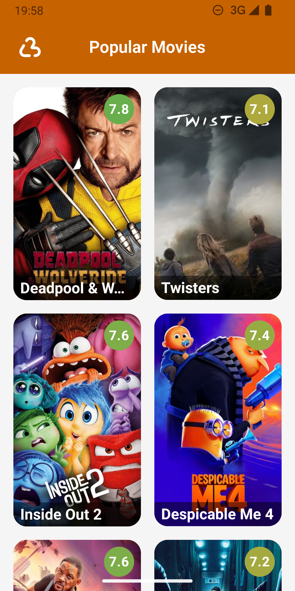
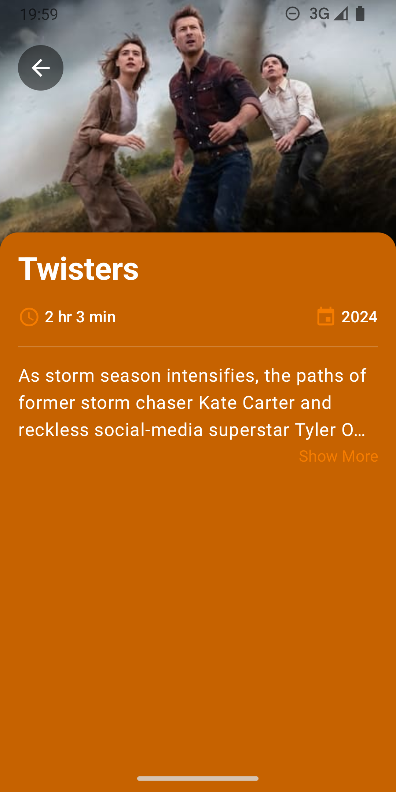

# 🎬 Lumi - The Movie App


Lumi is an Android application designed to showcase popular movies and detailed movie information using the [TMDB API](https://developer.themoviedb.org/reference/movie-popular-list). 

## 📱 Screenshots

<p float="left">
  
  
</p>

## 🚀 Features

- **Movie List Screen** displays a list of popular movies with their poster, title, and rating.
- **Movie Details Screen** provides detailed information about a selected movie, including the background image, title, overview, runtime, and release date.

## 📦 Project Structure

```
- data/
  - api/                  
  - mappers/             
  - models/               
  - repository/           

- domain/
  - models/               
  - repositories/         

- presentation/
  - components/           
  - screens/              
  - viewmodels/   

- di/        

- utils/          
```

## 🏗️ Build Instructions

1. **Clone the repository**
   ```
   git clone https://github.com/Merkost/Lumi.git
   ```
2. **Get TMDB API Key**

   Register and get an API key from [TMDB](https://developer.themoviedb.org/reference/intro/getting-started).
3. **Set up the API Key in the Project**
   
   Configure the API key in your local.properties file as:
   ```
   MOVIE_DB_AUTH_TOKEN=yout_api_token_here
   ```
4. **Build the app with Android Studio**


                       
